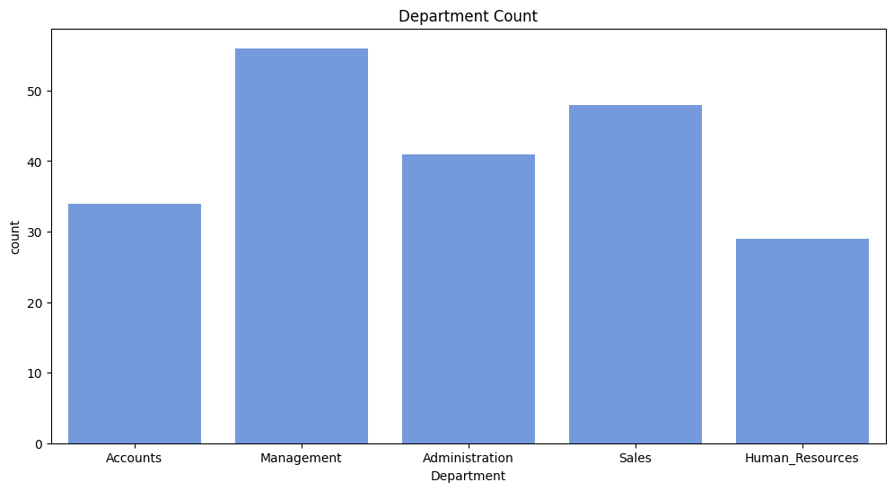
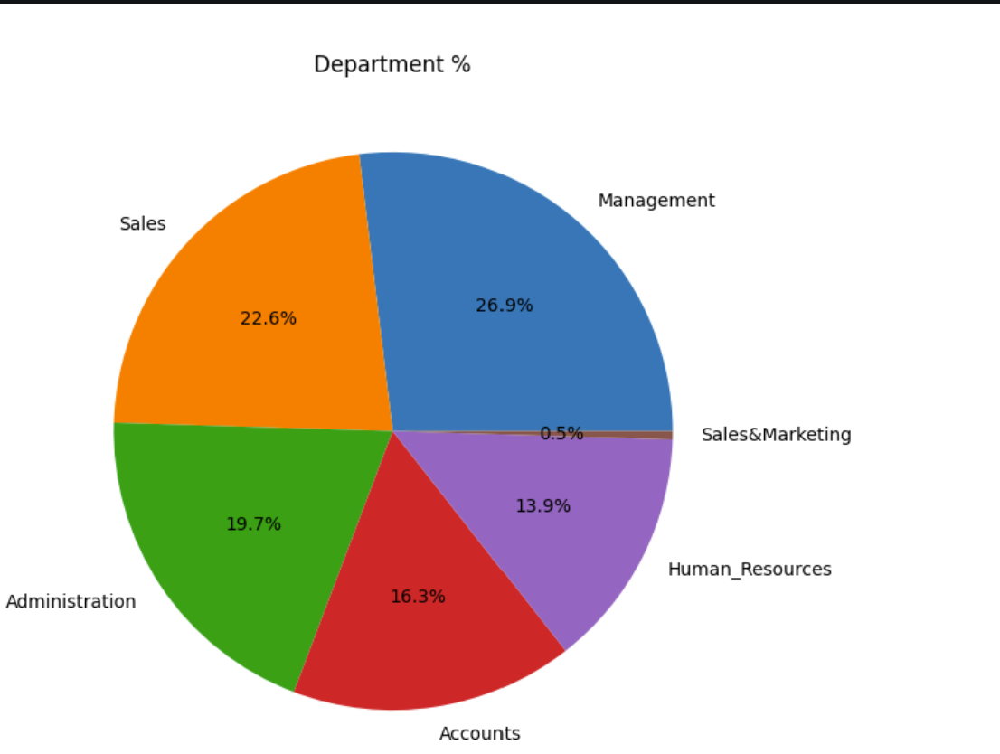
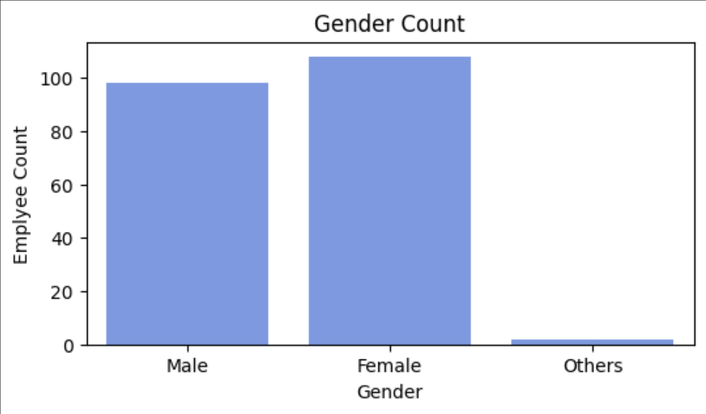
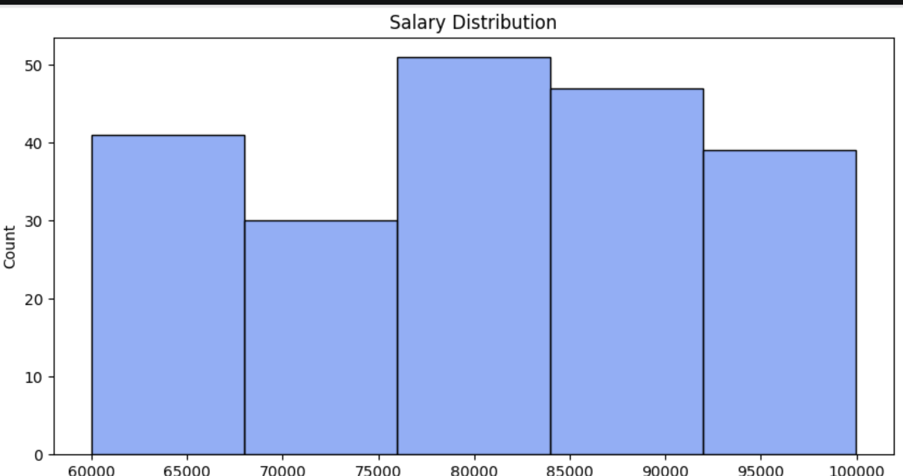
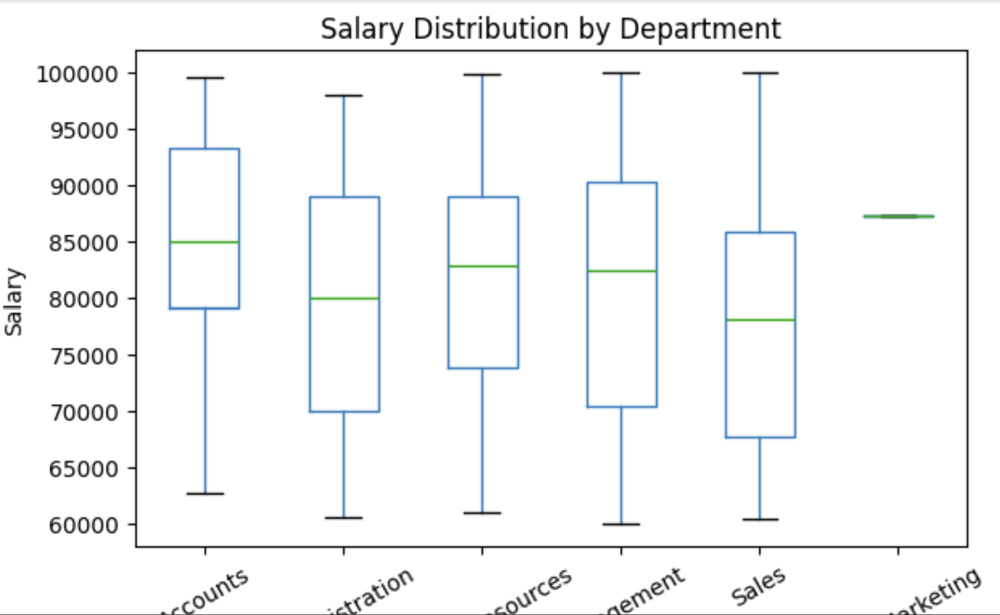

# 🧹 Python Data Cleaning and Exploratory Data Analysis (EDA)

A beginner-friendly **Python & Pandas** project that demonstrates the complete process of cleaning messy data and performing **Exploratory Data Analysis (EDA)** to generate meaningful business insights.

---

# 📌 Project Overview

The goal of this project is to transform a raw, unclean dataset into a clean, analysis-ready dataset using Python.

The project covers the complete data cleaning workflow, including:

- Handling missing values
- Removing duplicate records
- Correcting data types
- Standardizing inconsistent values
- Renaming columns where required
- Saving the cleaned dataset
- Performing Exploratory Data Analysis (EDA)
- Creating visualizations to uncover business insights

---

# 🛠️ Technologies Used

- **Python**
- **Pandas**
- **NumPy**
- **Matplotlib**
- **Jupyter Notebook**

---

# 📂 Project Structure

```text
python-data-cleaning-and-eda/
│
├── data/
│ ├── Uncleaned_practice.csv
│ └── cleaned_data.csv
│
├── notebook/
│ └── data_cleaning_and_eda.ipynb
│
├── images/
│ ├── department_count_chart.png
│ ├── department_distribution_pie_chart.png
│ ├── gender_count.png
│ ├── salary_distribution_histogram.png
│ └── salary_distribution_by_department_boxplot.png
│
├── README.md
├── requirements.txt
└── .gitignore
```

---

# 🧹 Data Cleaning Process

The following data cleaning techniques were applied:

- Imported the dataset using Pandas
- Explored the dataset using `head()`, `info()`, and `describe()`
- Checked for missing values
- Removed duplicate records
- Corrected incorrect data types
- Renamed columns for better readability
- Cleaned inconsistent values
- Saved the cleaned dataset

---

# 📊 Exploratory Data Analysis (EDA)

The following visualizations were created:

- 📈 Employee Count by Department
- 👥 Gender Distribution
- 💰 Salary Distribution Histogram
- 🥧 Department Percentage Distribution
- 📦 Salary Distribution by Department (Box Plot)

---

# 💡 Key Insights

### 👨‍💼 Department Distribution

- Management has the highest number of employees.
- Sales is the second-largest department.
- Sales & Marketing has the fewest employees.

### 👥 Gender Distribution

- Male and female employees are nearly equally represented.
- Very few records belong to the "Others" category.

### 💰 Salary Distribution

- Most employee salaries fall between **₹75,000 and ₹95,000**.
- The salary distribution is fairly balanced without extreme concentration at one value.

### 📦 Salary by Department

- Accounts has one of the highest median salaries.
- Sales has a comparatively lower median salary.
- Salary ranges are similar across most departments.
- Sales & Marketing contains very few records, so its salary distribution cannot be meaningfully compared.

---

# 📷 Project Visualizations

The project includes visualizations such as:

## Department Count Chart
<p align="center">
  
</p>

## Department Distribution Pie Chart
<p align="center">
  
</p>

## Gender Count Chart
<p align="center">
  
</p>

## Salary Distribution Histogram
<p align="center">
  
</p>

## Salary Distribution by Department Box Plot
<p align="center">
  
</p>

---

# 🚀 Skills Demonstrated

Through this project, I practiced:

- Data Cleaning
- Data Preprocessing
- Exploratory Data Analysis (EDA)
- Data Visualization
- Python Programming
- Pandas
- NumPy
- Matplotlib

---

# ▶️ How to Run the Project

1. Clone this repository.

```bash
git clone https://github.com/Bhupesh456/python-data-cleaning-and-eda.git
```

2. Install the required libraries.

```bash
pip install -r requirements.txt
```

3. Open the Jupyter Notebook.

```bash
jupyter notebook
```

4. Run all cells to reproduce the analysis.

---

# 📁 Dataset

This project contains:

- Raw dataset (`Uncleaned_practice.csv`)
- Cleaned dataset (`cleaned_data.csv`)

The cleaned dataset is ready for further analysis and visualization.

---


---

# 👨‍💻 Author

**Bhupesh**

**Aspiring Data Analyst**

### Skills

- Python
- Pandas
- SQL
- Excel
- Power BI
- Data Cleaning
- Exploratory Data Analysis (EDA)

---

⭐ **If you found this project useful, feel free to star the repository.**
